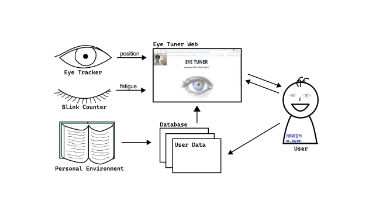
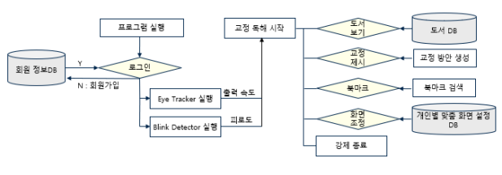

# Eye-Tuner

> Participants
> * 연세대학교 기계공학과 19학번 **[장민준](https://github.com/wkdalswns0427/)**
> * 연세대학교 글로벌융합공학부 20학번 **[변정윤](https://github.com/bluesaurus01/)**
> * 연세대학교 의예과 20학번 **[김동하](https://github.com/kdha0727/)**
> * 연세대학교 행정학과 20학번 **[최귀주](https://github.com/dangnaguiruns/)**

---

# Achievements

1. 한국저작권위원회 **저작권 등록** - 등록명: `Eye Tuner(아이튜너)`
2. 디지털헬스케어 및 차세대 재활복지 **MEDICAL HACK 2021 우수상**
3. 한이음 공모전 입선
4. 연세대학교 고등교육혁신원 워크스테이션 **Impact Solution Award**
5. 워크스테이션 **Show-Off Festa Best Choice Award**
6. To be continued...

---

# About Eye Tuner

1) **Eye Tuner는 개인 맞춤형 디지털 독해 웹사이트이다.**
   - 시선 추적을 통해 사용자의 시선 이동 속도, 읽기 습관 등을 파악하여 사용자에게 맞춤 속도로 텍스트를 출력한다.
   - 사용자의 안구 피로도를 측정하여 사용자에게 피로 상황을 알린다.
   - 사용자의 맞춤 화면 환경을 저장한다.
2) **Eye Tuner는 디지털 독해 문화 개선을 목표로 한다.**
   - 사용자가 모든 텍스트를 읽도록 출력 속도와 글자 크기 등을 조정한다.
   - 화면 조정을 통해 추가적인 시력 저하를 예방하고자 한다.
   - 독해의 집중 유지를 위해 지속적인 피드백을 제공한다.

---

# Why We Need Eye Tuner?

1) **디지털 콘텐츠 이용 시간 증가에 따른 눈의 피로도 증가**
   - 코로나19로 인한 언택트 시대를 맞이하여 디지털 기기의 사용이 보편화되어 생활에 불가피해짐에 따라 과도한 디지털 기기 이용으로 인한 시각적 불편을 호소하는 이용자가 증가하였다.
2) **디지털 콘텐츠 자체 특성으로 인한 디지털 콘텐츠 독해, 이해 문제 발생**
   - 뉴스, 논문, 등 다양한 서비스가 모두 디지털화되었지만 인터넷을 통해 글을 읽기 시작하면서 글의 내용을 선택적으로 읽거나 일부분은 생략해서 읽는 습관이 길러졌다. 이는 학습이나 업무 환경에서 집중력 저하의 문제와 직결된다.
3) **개인 맞춤형 디지털 안구 건강을 제공하는 프로그램 미비**
   - ‘전 연령층의 건강한 삶 보장과 웰빙 증진’을 달성하기 위해 일상에 많은 영향을 미치는 ‘디지털 기기의 화면 조정’에 집중한다. 
   - 좁은 의미의 건강 차원에서 본팀은 눈을 편안하게 하는 ‘채도’와 ‘명도’의 구성으로 화면을 변경하여 사용자의 안구 건강을 도모한다.
   - 넓은 의미의 건강한 삶과 웰빙 측면에서 본팀은 하이퍼텍스트 상의 올바른 독해 가이드라인을 화면 상에 모션으로 제시한다. 이를 통해 어린아이부터 성인까지 디지털 기기 상의 텍스트를 올바른 방식으로 독해한다면, 수용하는 정보에 대한 판별력이 길러질 것이다.

---

# Features of Eye Tuner

1) **문턱이 낮은 건강관리 모델을 제공한다.**
   - Eye Tuner Web은 사람의 오감 중 가장 가변적이고 일상에 필수적인 ‘눈’과 ‘눈 건강’을 다룬다. 본 팀은 누구나 쉽게 접근할 수 있는 웹을 활용하여 부가적인 물품 구입이나 의료 치료 없이 눈 건강을 관리할 수 있는 모델을 제공한다. 다수의 안과 전문의와 교수님과의 면담을 통해 눈 건강에 부합하는 모델을 디자인했다.
2) **눈 건강 관리를 넘어서 개인의 건강한 라이프스타일을 총체적으로 서포트한다.**
   - 본팀은 단순히 눈 건강 관리를 하는 프로그램을 다루는 것이 아니라 일과 휴식을 구분하여 효율적으로 일하고 쉬는 라이프스타일의 방향을 제공한다. 기존에 존재했던 다른 모델은 눈 건강에만 초점을 맞추거나 라이프스타일 자체만을 강조했다면 Eye Tuner Web은 눈 건강에서 라이프스타일로 이어지는 연결고리를 찾아 사용자에게 미시적, 거시적 삶의 질 향상을 제공하려 한다.
3) **지속적이고 확산 가능한 프로그램을 개발한다.**
   - 본 팀은 ‘웹을 제작하고 배포 할 뿐만 아니라 다른 기관이나 기업의 프로그램에도 적용 가능하게 ‘프로그램’형태로 제작물을 남겨놓을 예정이다. 이로써 다른 기관이나 기업과의 협업이 가능하며 더 넓은 범위의 사람들에게 본 팀이 개발한 기능을 ‘확산’할 수 있다. 본 팀은 각 팀원이 기존에 인턴으로 근무했던 기관, 프로젝트를 진행했던 경험으로 쌓아온 인적 네트워크, 해당 기술을 공모하는 사업체를 활용하여 협업 단체를 모색할 예정이다. 

---

# Project Diagram

## Interaction with User



## Function Flow Chart



---

# Folder Structure

* `eyetuner_flask/` : Flask Web Runtime
* `python/` : Python Local Runtime 
* `words/` : example data
* `assets/` : images of project diagram
* `FLASK_FIRST_SHORTCUT.py` : script for initializing database
* `FLASK_RUN_SHORTCUT.py` : script for serving eye tuner web
* `FLASK_SHELL_SHORTCUT.py` : script for managing web via flask interactive shell
* `requirements.txt` : list of python libraries required in eye tuner web or python implements

---

# How to run

## 1. Setup your environments
```bash
$ pyenv install 3.8.10
$ pyenv virtualenv 3.8.10 venv-eye-tuner
$ pyenv activate venv-eye-tuner
$ pip install -r requirements.txt
```

## 2. Initialize Database
```bash
$ python FLASK_FIRST_SHORTCUT.py
```

## 3. Run Local Server
```bash
$ python FLASK_RUN_SHORTCUT.py
```

## 4. Flask Interactive Shell
```bash
$ python FLASK_SHELL_SHORTCUT.py
```

---

